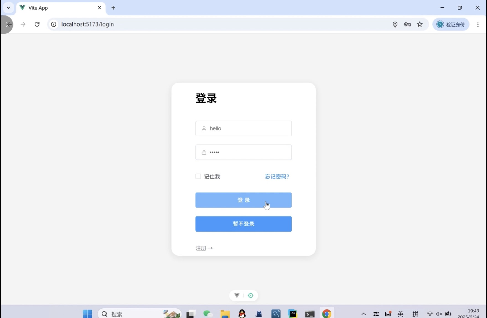

# 🏠 TOtoTO（图to图） — From Image, To Image

🔍 TOtoTO is a web-based system designed for intelligent image search and location-aware tour guidance. It focuses on the beautiful scenery of **South China University of Technology (SCUT), University Town Campus**.

---

 **Project Overview项目简介**

> TOtoTO 是一个基于图像搜索与地图定位的智能导览系统，服务对象为中国华南理工大学大学城校区。通过上传校园照片，系统能智能识别地点，展示相似场景，并提供 AI 导游解说、历史记录查看等功能，打造沉浸式校园参观体验。

> 🌐 TOtoTO is an intelligent tour guide platform focused on SCUT’s University Town Campus. By uploading a campus photo, users can:
> - 🔍 Find visually similar scenes
> - 🗺️ Locate the photo’s real-world position
> - 🤖 Get AI-generated historical and cultural introductions
> - 🕓 View their search history and revisit details

✨ This project blends computer vision, location services, and natural language generation into one user-friendly web experience.

---

# Main Function Introduction

> Main Function Page  
> Home Page  
> Login Page  

## Main Function Page
In this page, when user uploads a picture and our system finishes every management, this Web page will show you the SIMILAR PICTURES, the POSITION of the user's picture, and AI TOUR GUIDE's intruduction.  

  
   
  <em>Figure 1: Main Function Page</em>

In the main page, if you click a HISTORY RECORD, the Main Page will show you the Information of the record, but will NOT show you the LLM results.  

  
   
  <em>Figure 2: Main Function Page————Get History Record</em>

 If you click the SAME History Record again, it will go back to the Main Page.

 ## Home Page
Users can view the University's Pictures or send text. If you upload a picture, the view will turn to Main Function Page's view.  

  
   
  <em>Figure 3: Home Page</em>

## Login
Some main functions need users login to use. If you do not have any accounts, you can also create an account.  
Meanwhile, we support binding the account with your own email.

  
   
  <em>Figure 4: Login Page</em>

---

# 🧩 Project Structure and some important Details
> TOtoTO adopts a **frontend-backend separated architecture**, built with Vue 3 + Flask, and uses **MySQL** and **GitHub repository** for data and asset storage.
> 
> - The frontend is built with **Vue 3 + Vite**, responsible for user interaction and dynamic UI rendering
> - The backend uses **Flask** to provide RESTful APIs and handle core logic
> - **MySQL** is used as the main database to store user info, image metadata, history records, etc.
> - User Uploaded Images are stored through the **GitHub repository** for quick access and management
> - The frontend and backend communicate via **HTTP API** with CORS enabled

## Backend————Img_To_Img Flask

## Frontend————Img_To_Img Vue3

## MySQL Database————db_pic_faiss

