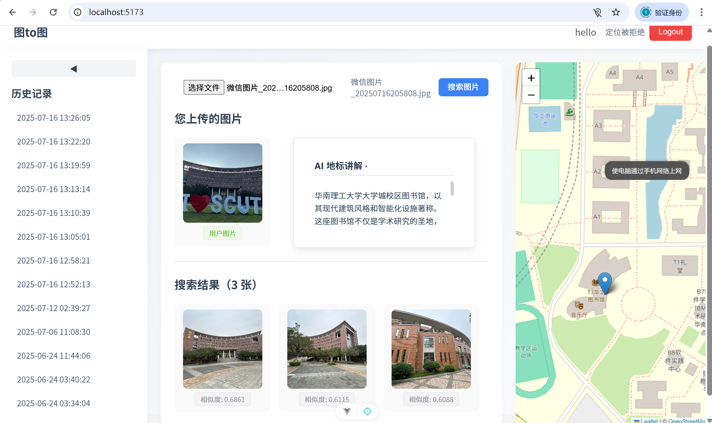
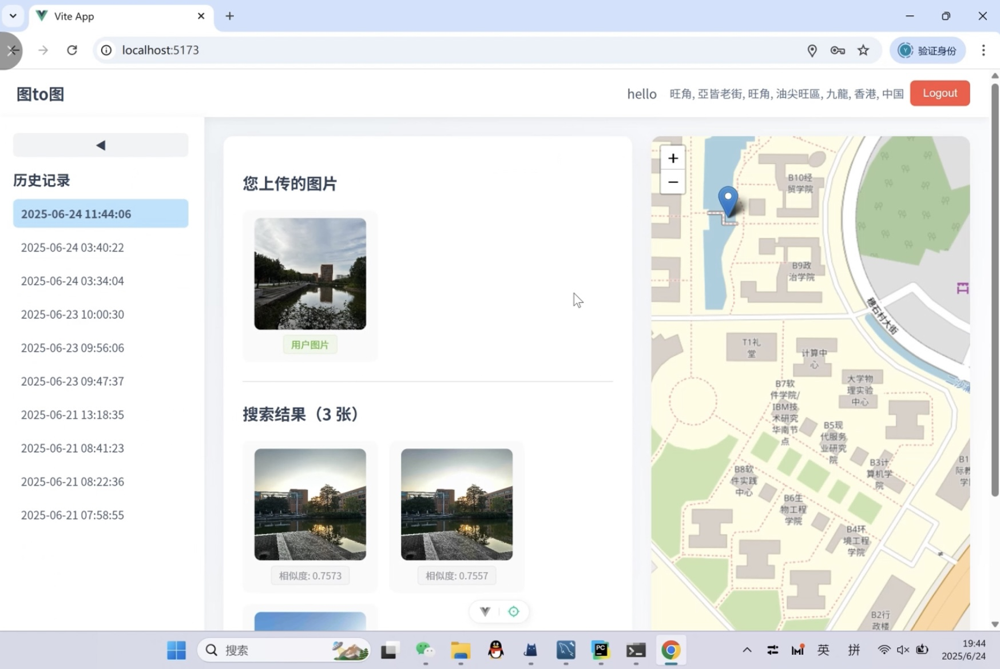
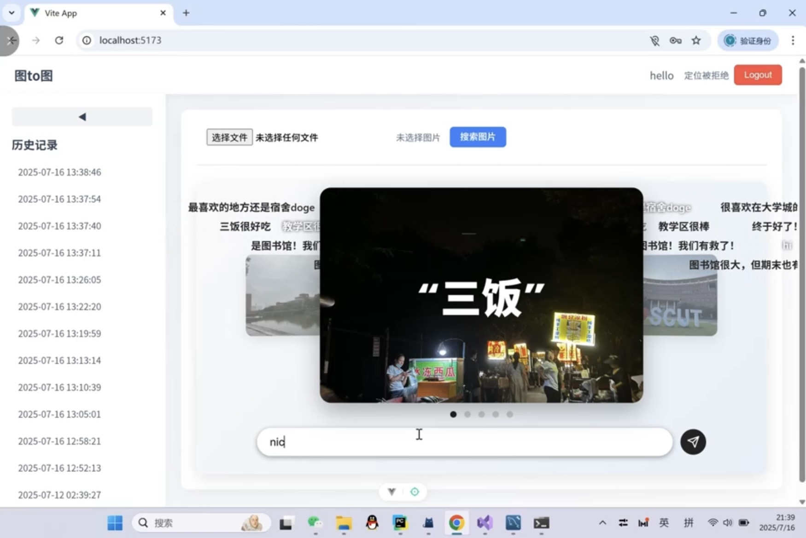

# TOtoTO

A Web project based on Faiss that can allow you to find similar images, also mainly supports map function and AI tour guide function.

---

# Main Function Introduction

> Main Function Page  
> Main Page  
> Login Page  

## Main Function Page
In this page, when user uploads a picture and our system finishes every management, this Web page will show you the SIMILAR PICTURES, the POSITION of the user's picture, and AI TOUR GUIDE's intruduction.  

  
   
  <em>Figure 1: Main Function Page</em>

In the main page, if you click a HISTORY RECORD, the Main Page will show you the Information of the record, but will NOT show you the LLM results.  

  
   
  <em>Figure 2: Main Function Page————Get History Record</em>

 If you click the SAME History Record again, it will go back to the Main Page.

 ## Main Page
This is the Main Page, you can view the University's Pictures or send text. If you upload a picture, the view will turn to Main Function Page's view.  

  
   
  <em>Figure 3: Main Page</em>

---

## 🧩 Project Structure

